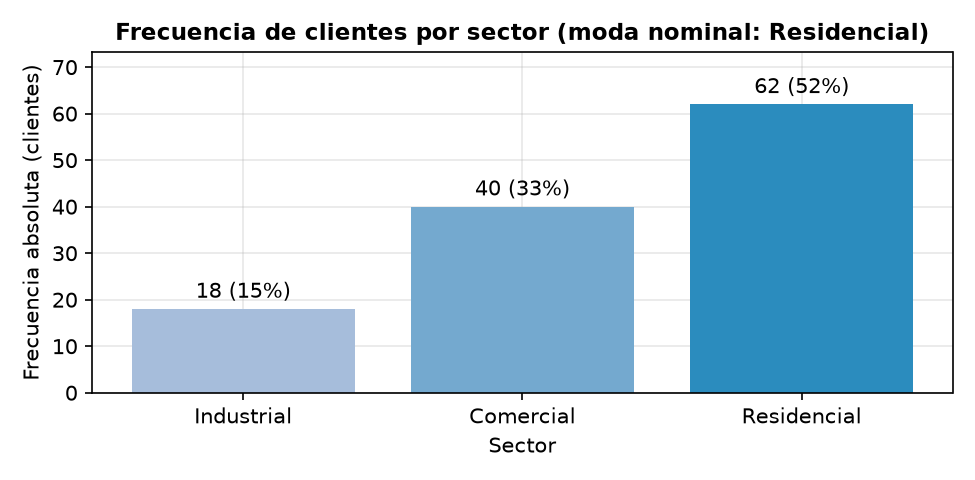
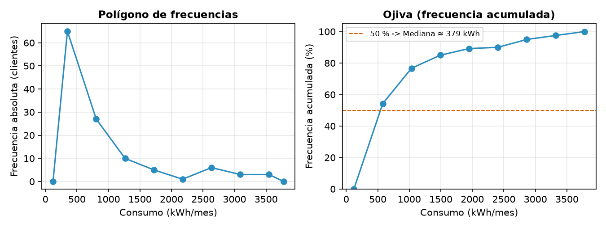
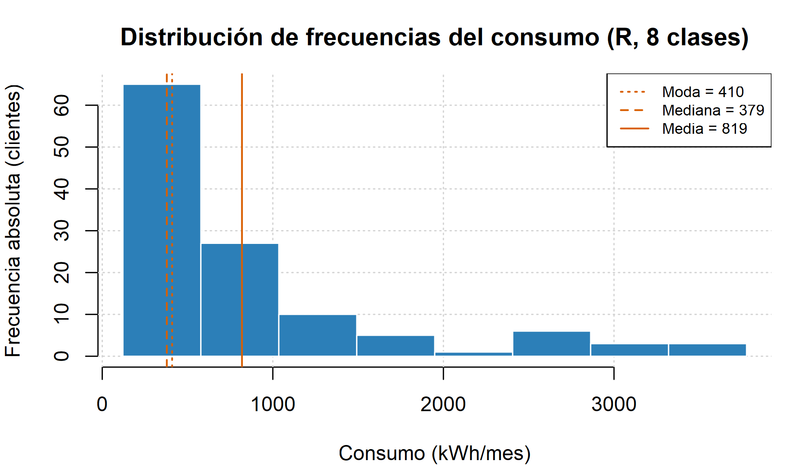
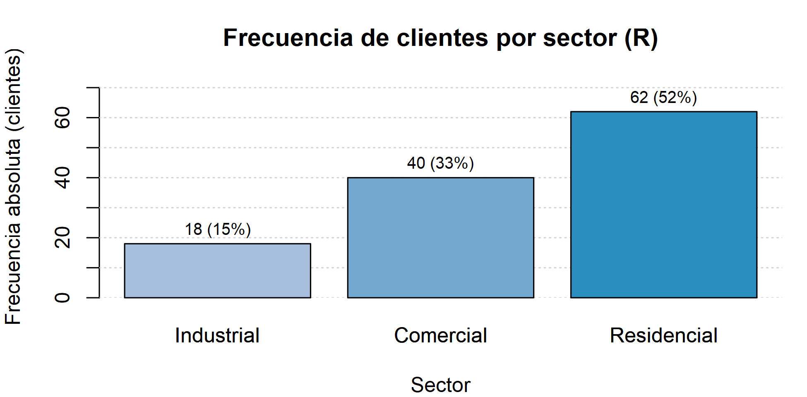
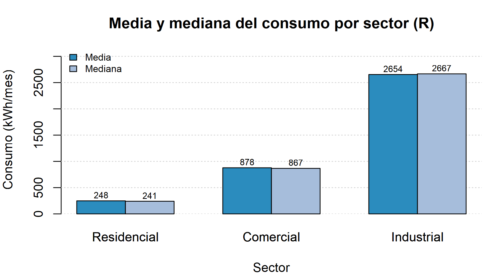
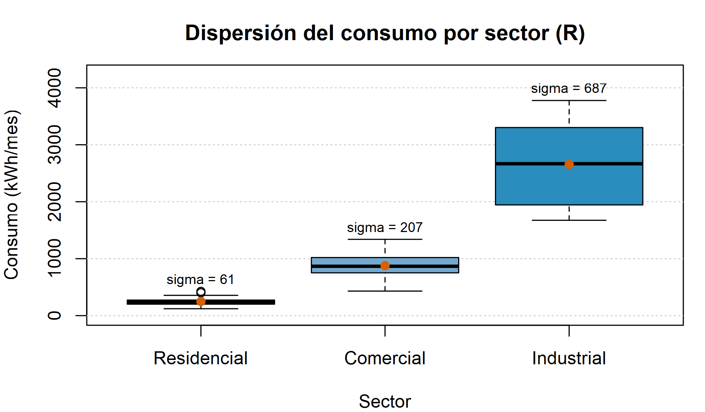
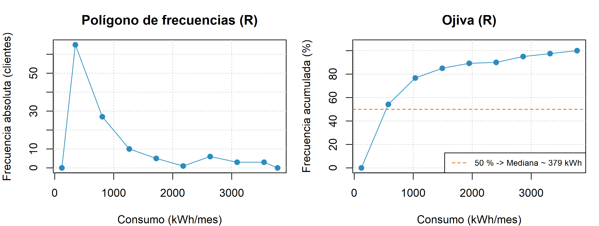

<div align="center">
    
</div>

# Análisis Estadístico de Datos y Creación de Gráficos Básicos

## 📋 Información General

<div align="center">
    
</div>

| Aspecto | Detalles |
|--------|----------|
| **Autor** | Andrés Giovanny Rubiano Muñoz "Andy Rubiano" |
| **Correo** | arubiano67@unisalle.edu.co |
| **Asignatura** | Ciencia de Datos — Actividad 2 |
| **Programa** | Maestría en Inteligencia Artificial |
| **Universidad** | Universidad de La Salle |
| **Herramientas** | Python 3.14 (Matplotlib + pandas + NumPy) y R 4.6 (graficación base) |
| **Año** | 2026 |
| **Estado** | Completado |

---

## 🎯 Descripción del Proyecto

Laboratorio de **estadística descriptiva** sobre el mismo conjunto de datos simulado de consumo energético mensual de **120 clientes** de una empresa distribuidora de energía (sectores Residencial, Comercial e Industrial) empleado en la Actividad 1. Al reutilizar la semilla fija `default_rng(42)`, las 120 observaciones son idénticas, lo que da **continuidad analítica** entre ambas actividades: donde la primera se centró en los principios de diseño gráfico, esta se centra en **cuantificar** la distribución antes de graficarla.

El proyecto desarrolla:

- **Distribución de frecuencias** construida con la **regla de Sturges** (k = 1 + 3,322·log₁₀ n), con límites de clase, marca de clase y frecuencias absolutas (fi), acumuladas (Fi), relativas (hi %) y relativas acumuladas (Hi %).
- **Medidas de tendencia central:** media, mediana y **moda interpolada** por clase modal (Mo = L + d₁/(d₁+d₂)·w), calculadas por sector y a nivel global, más la moda de la variable nominal `sector`.
- **Medidas de dispersión:** rango, varianza y desviación estándar muestrales (ddof = 1), coeficiente de variación, cuartiles y rango intercuartílico.
- **Gráficos básicos** que traducen cada tabla en una figura: histograma de Sturges, polígono de frecuencias, ojiva, barras de frecuencia, barras agrupadas media vs. mediana y diagrama de caja.
- **Verificación cruzada Python ↔ R:** R recalcula de forma independiente toda la estadística y replica las figuras; los resultados coinciden **dígito a dígito**.

### Objetivos Principales

- Construir una distribución de frecuencias completa aplicando la regla de Sturges.
- Calcular e interpretar las medidas de tendencia central y de dispersión sobre datos agrupados y sin agrupar.
- Representar cada resultado estadístico con el gráfico básico adecuado, manteniendo los principios de diseño de la Actividad 1.
- Validar el análisis mediante una implementación independiente en R sobre el mismo dataset.

---

## 📚 Estructura del Repositorio

```
.
├── README.md                                     # Este archivo
├── requirements.txt                              # Dependencias de Python
├── .gitignore                                    # Excluye venv/, __pycache__/, .Rhistory, .vscode/
├── data/
│   ├── dataset/
│   │   └── consumo_energia.csv                   # Dataset generado (semilla 42, reproducible)
│   └── processed/
│       ├── freq_table.csv                        # Distribución de frecuencias (Sturges): fi, Fi, hi %, Hi %
│       ├── central_tendency.csv                  # Media, mediana y moda interpolada por sector y global
│       └── dispersion.csv                        # Rango, varianza, desv. est., CV, Q1, Q3 e IQR
├── public/
│   └── assets/
│       └── images/
│           ├── Logo.png                          # Logo institucional
│           ├── author/                           # Foto del autor
│           └── figures/
│               ├── python/
│               │   └── statistics/               # 5 figuras generadas con Matplotlib
│               └── r/
│                   └── statistics/               # 5 figuras replicadas con R base
└── utils/
    └── codes/
        ├── statistics.py                         # Genera dataset, tablas estadísticas y figuras (Python)
        └── statistics.R                          # Recalcula la estadística y replica figuras (R)
```

---

## 🧪 Pipeline del Laboratorio

El flujo es **secuencial**: Python regenera los datos, produce las tres tablas estadísticas y sus figuras; R consume el mismo CSV, recalcula todo de forma independiente y replica las gráficas, permitiendo la verificación cruzada.

### Fase 1 · Cálculo estadístico y figuras en Python

[`statistics.py`](utils/codes/statistics.py) reconstruye el dataset con la semilla fija de la Actividad 1, aplica la regla de Sturges, calcula las medidas de tendencia central y dispersión, y produce las figuras con Matplotlib.

| Salida | Ubicación | Descripción |
|---|---|---|
| Dataset | `data/dataset/consumo_energia.csv` | 120 registros: cliente, sector, consumo (kWh), costo (miles COP) |
| Tabla de frecuencias | `data/processed/freq_table.csv` | 8 clases de Sturges con fi, Fi, hi % y Hi % |
| Tendencia central | `data/processed/central_tendency.csv` | Media, mediana y moda interpolada por sector y global |
| Dispersión | `data/processed/dispersion.csv` | Rango, varianza, desv. est., CV, Q1, Q3 e IQR |
| Figuras | `public/assets/images/figures/python/statistics/` | 5 gráficas con título informativo, unidades, eje desde cero y etiquetas de datos |

### Fase 2 · Recálculo y verificación en R

[`statistics.R`](utils/codes/statistics.R) lee el CSV de la Fase 1 y **no reutiliza ningún valor de Python**: recalcula las clases de Sturges, la moda interpolada (misma fórmula de agrupados) y los estadísticos muestrales con `var()` y `sd()`, que en R son ddof = 1 igual que en pandas. Cada figura se dibuja en dos pasadas para que la cuadrícula quede **detrás** de los datos.

| Salida | Ubicación | Descripción |
|---|---|---|
| Figuras | `public/assets/images/figures/r/statistics/` | Las 5 réplicas: histograma, polígono + ojiva, barras de frecuencia, media vs. mediana y diagrama de caja |
| Verificación | Consola | Tabla de frecuencias y estadísticos — deben coincidir con los CSV de Python |

**Características clave:**

- **Reproducibilidad:** semilla fija (`default_rng(42)`); cualquier ejecución produce las mismas 120 observaciones, tablas y figuras que la Actividad 1.
- **Rutas:** Python resuelve las suyas desde la ubicación del script (`Path(__file__)`), por lo que se puede invocar desde cualquier carpeta. R usa rutas **relativas a la raíz del proyecto**, así que debe ejecutarse desde ahí; ambos scripts crean las carpetas de salida si no existen (`mkdir(parents=True)` / `dir.create(recursive = TRUE)`).
- **Verificación cruzada:** las ocho clases de Sturges, la moda interpolada y todos los estadísticos coinciden **dígito a dígito** entre Python y R.
- **Consistencia de diseño:** las figuras conservan los principios de la Actividad 1 — título informativo, ejes con unidades, eje de frecuencias desde cero, cuadrícula sutil detrás de los datos, color funcional y etiquetas de datos.

---

## ⚙️ Requisitos

### Python

> ⚠️ **Versión:** Python 3.10 o superior (probado en **3.14.7**), con entorno virtual dedicado (`venv/`).

| Dependencia | Versión probada | Uso |
|---|---|---|
| `numpy` | 2.5.2 | Generación del dataset, histogramas y cálculo numérico |
| `pandas` | 3.0.5 | Tablas estadísticas, cuartiles y manejo del CSV |
| `matplotlib` | 3.11.1 | Generación de todas las figuras de Python |

> ℹ️ El diagrama de caja usa el parámetro `tick_labels` de `Axes.boxplot`, disponible desde **Matplotlib 3.9**.

El resto de entradas de [`requirements.txt`](requirements.txt) son dependencias transitivas de Matplotlib y pandas.

**Nota sobre la actualización a Python 3.14:** el proyecto se desarrolló inicialmente en Python 3.12.10 con NumPy 2.5.1 y se migró a **Python 3.14.7 con NumPy 2.5.2**. La ejecución bajo el nuevo intérprete reproduce las tres tablas de `data/processed/` y las cinco figuras **byte a byte idénticas**, sin advertencias de deprecación: el generador `default_rng(42)` mantiene su secuencia entre versiones menores de NumPy, de modo que la reproducibilidad del laboratorio no depende del intérprete.

### R

- **R 4.x** (probado en 4.6.1) — solo graficación base, sin paquetes adicionales.
- Los dispositivos PNG se abren con `type = "cairo"` para obtener texto antialiasado a 300 ppp.
- Editor: RStudio Desktop o VS Code con la extensión **R** (REditorSupport) + `languageserver`.

---

## 🛠️ Ejecución

> Ambos comandos se lanzan **desde la raíz del proyecto** (`visualizations/`), porque el script de R resuelve sus rutas de forma relativa.

```bash
# 1. Entorno de Python
py -3.14 -m venv venv           # o `python -m venv venv` si 3.14 ya es el intérprete por defecto
source venv/Scripts/activate    # Git Bash (en PowerShell: venv\Scripts\activate)
pip install -r requirements.txt

# 2. Fase 1: dataset, tablas estadísticas y figuras de Python
python utils/codes/statistics.py

# 3. Fase 2: figuras de R y verificación cruzada
Rscript utils/codes/statistics.R
```

Si `Rscript` no está en el `PATH` de Git Bash, añádelo a la sesión antes del paso 3:

```bash
export PATH="/c/Program Files/R/R-4.6.1/bin/x64:$PATH"
```

En VS Code, el script de R también puede ejecutarse con **Ctrl + Shift + S** (source del archivo) o línea a línea con **Ctrl + Enter** desde la terminal R Interactive.

---

## 🖼️ Galería de Figuras

### Distribución de frecuencias y tendencia central (Python · Matplotlib)

| | |
|---|---|
|  |  |
| **Histograma de Sturges** — 8 clases con moda, mediana y media superpuestas: moda y mediana caen juntas en la primera clase mientras la media se desplaza a la derecha | **Barras de frecuencia** — distribución de la variable nominal, ordenada por magnitud y etiquetada con n (%) |

<div align="center">
    
</div>

**Polígono de frecuencias y ojiva** — dos lecturas de la misma tabla: la puntual (marca de clase vs. fi) y la acumulada (límite superior vs. Hi %), donde el corte con el 50 % localiza gráficamente la mediana.

### Dispersión y comparación entre sectores (Python · Matplotlib)

| | |
|---|---|
|  |  |
| **Barras agrupadas media vs. mediana** — su cercanía dentro de cada sector revela simetría local pese a la asimetría global | **Diagrama de caja con media y σ** — posición (mediana), dispersión (IQR y bigotes) y su relación con la desviación estándar |

### Réplica en R (graficación base)

Las cinco figuras de Matplotlib tienen su equivalente en graficación base de R, construidas sobre estadísticos recalculados de forma independiente.

| | |
|---|---|
|  |  |
| **Histograma de Sturges** — mismas 8 clases y mismas medidas de posición | **Frecuencia por sector** — n (%) sobre cada barra |
|  |  |
| **Media vs. mediana** — `barplot(beside = TRUE)` sobre `tapply` | **Dispersión por sector** — caja, media y σ |

<div align="center">
    
</div>

**Polígono de frecuencias y ojiva en R** — dos paneles con `par(mfrow = c(1, 2))`; la misma lectura puntual y acumulada de la tabla de frecuencias recalculada con `hist(..., plot = FALSE)$counts`.

---

## 📊 Resultados

### Distribución de frecuencias (regla de Sturges, k = 8, amplitud 457,0 kWh)

| Clase | Límites (kWh) | Marca | fi | Fi | hi (%) | Hi (%) |
|---|---|---|---|---|---|---|
| 1 | 121,2 – 578,2 | 349,7 | 65 | 65 | 54,2 | 54,2 |
| 2 | 578,2 – 1 035,2 | 806,7 | 27 | 92 | 22,5 | 76,7 |
| 3 | 1 035,2 – 1 492,2 | 1 263,7 | 10 | 102 | 8,3 | 85,0 |
| 4 | 1 492,2 – 1 949,2 | 1 720,7 | 5 | 107 | 4,2 | 89,2 |
| 5 | 1 949,2 – 2 406,1 | 2 177,6 | 1 | 108 | 0,8 | 90,0 |
| 6 | 2 406,1 – 2 863,1 | 2 634,6 | 6 | 114 | 5,0 | 95,0 |
| 7 | 2 863,1 – 3 320,1 | 3 091,6 | 3 | 117 | 2,5 | 97,5 |
| 8 | 3 320,1 – 3 777,1 | 3 548,6 | 3 | 120 | 2,5 | 100,0 |

La primera clase concentra el **54,2 %** de los clientes y el 76,7 % acumulado está por debajo de 1 035 kWh: la cola derecha es larga pero poco poblada.

### Tendencia central y dispersión del consumo (kWh/mes)

| Grupo | n | Media | Mediana | Moda interp. | Rango | Varianza | Desv. est. | CV (%) | IQR |
|---|---|---|---|---|---|---|---|---|---|
| Residencial | 62 | 248,3 | 240,6 | 232,7 | 303,6 | 3 736,3 | 61,1 | 24,6 | 69,5 |
| Comercial | 40 | 878,1 | 866,6 | 787,8 | 908,4 | 42 989,5 | 207,3 | 23,6 | 255,3 |
| Industrial | 18 | 2 654,0 | 2 666,8 | 1 849,3 | 2 103,1 | 471 785,8 | 686,9 | 25,9 | 1 322,8 |
| **Global** | **120** | **819,1** | **378,6** | **409,6** | **3 655,9** | **763 564,7** | **873,8** | **106,7** | **742,0** |

- **Moda de la variable nominal `sector`: Residencial** (62 de 120 clientes, 52 %).
- **Asimetría positiva marcada a nivel global:** la moda interpolada (409,6) y la mediana (378,6) caen ambas dentro de la primera clase, mientras la media (819,1) se desplaza hacia la cola derecha —más del doble de la mediana—. La media global **no representa a ningún cliente típico**; la mediana es el resumen honesto de la distribución.
- **La heterogeneidad es entre sectores, no dentro de ellos:** el CV global (**106,7 %**) cuadruplica el de cualquier sector individual (23,6 %–25,9 %). Los tres grupos tienen una variabilidad relativa prácticamente igual; lo que dispara la dispersión total es la diferencia de **escala** entre ellos (248 → 878 → 2 654 kWh).
- **Simetría local:** dentro de cada sector la media y la mediana difieren menos del 4 % (3,1 % en Residencial, 1,3 % en Comercial y 0,5 % en Industrial), coherente con la generación normal por grupo. La moda interpolada del sector Industrial (1 849,3) se aleja porque con n = 18 la regla de Sturges deja solo 6 clases y la clase modal queda ancha.
- **Verificación cruzada:** Python y R producen las mismas 8 clases, las mismas frecuencias y los mismos estadísticos **dígito a dígito**, validando la implementación de forma independiente.

---

## 🔑 Palabras Clave

`Estadística Descriptiva` · `Distribución de Frecuencias` · `Regla de Sturges` · `Tendencia Central` · `Dispersión` · `Matplotlib` · `pandas` · `R` · `Gráficos Básicos` · `Ciencia de Datos` · `Python`

---

## 📧 Contacto

**Andrés Giovanny Rubiano Muñoz**
Maestría en Inteligencia Artificial · Universidad de La Salle
arubiano67@unisalle.edu.co

---

## 📄 Derechos Reservados

© 2026 Andrés Giovanny Rubiano Muñoz (Andy Rubiano). Todos los derechos reservados.

Este laboratorio y su contenido —código, datos y documentación— son propiedad intelectual conjunta de:

- **Andrés Giovanny Rubiano Muñoz** (Andy Rubiano) — Autor
- **Universidad de La Salle** — Institución académica

El uso, reproducción o distribución requiere autorización previa escrita de los titulares de derechos.

---

<div align="center">
  Universidad de La Salle | Bogotá D. C., Colombia
</div>
